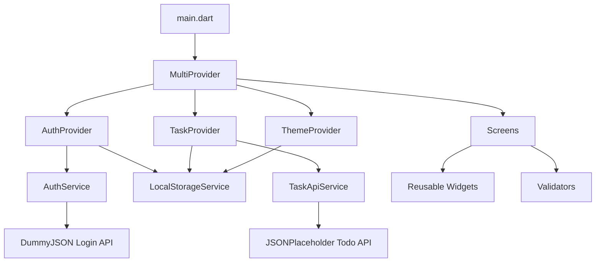
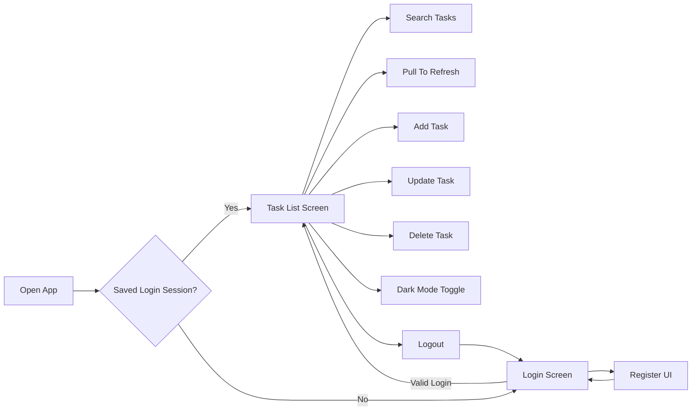
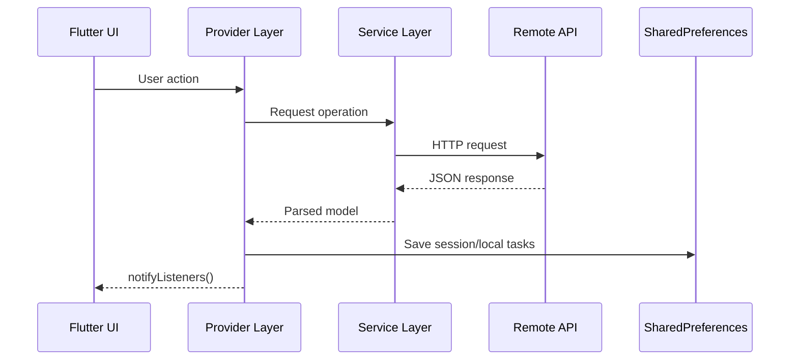

# APS Lanka Task Manager

<p align="center">
  
  
  
  
  
  
</p>

<p align="center">
  <strong>Flutter Intern Developer Test - APS Lanka pvt(Ltd) 2026</strong>
</p>

## APK Download

Download the release APK here:

[app-release.apk](https://github.com/ThisenSandeepa/aps-lanka-project/releases/download/V.1.0/app-release.apk)

## Project Overview

APS Lanka Task Manager is a Flutter mobile application developed according to the given intern developer test rubric. The app includes authentication UI, API login handling, task listing from a remote API, local task creation, task update/delete flows, local storage, Provider state management, validation, loading states, API error handling, pull to refresh, search, screenshots, and a release APK.

## Demo Credentials

```text
Email: test@gmail.com
Password: 123456
```

The app sends the login request to:

```text
POST https://dummyjson.com/auth/login
```

The exact rubric demo credentials are supported with a safe fallback response so the test login works reliably.

## Features

- Login screen with email and password validation
- Register screen UI with required fields and validation
- Provider state management
- SharedPreferences local storage
- Login session persistence
- Fetch tasks from JSONPlaceholder API
- Loading indicator while fetching tasks
- API error handling with retry UI
- Pull to refresh
- Search tasks by title or ID
- Add new tasks locally
- Store added tasks locally
- Update task title and completed status
- Delete task flow
- Completed and pending status display
- Reusable widgets
- Clean folder structure
- Dark mode support
- Simple row animations
- Widget and screenshot tests

## API Endpoints

| Module | Method | Endpoint |
|---|---:|---|
| Login | POST | `https://dummyjson.com/auth/login` |
| Task List | GET | `https://jsonplaceholder.typicode.com/todos` |
| Add Task | POST | Implemented in `TaskApiService.addTask()` with local persistence |
| Update Task | PUT | Implemented in `TaskApiService.updateTask()` |
| Delete Task | DELETE | Implemented in `TaskApiService.deleteTask()` |

## App Structure

```text
lib/
├── main.dart
├── models/
│   ├── task_model.dart
│   └── user_model.dart
├── providers/
│   ├── auth_provider.dart
│   ├── task_provider.dart
│   └── theme_provider.dart
├── screens/
│   ├── add_task_screen.dart
│   ├── login_screen.dart
│   ├── register_screen.dart
│   └── task_list_screen.dart
├── services/
│   ├── api_exception.dart
│   ├── auth_service.dart
│   ├── local_storage_service.dart
│   └── task_api_service.dart
├── utils/
│   ├── app_routes.dart
│   └── validators.dart
└── widgets/
    ├── app_text_field.dart
    ├── auth_shell.dart
    ├── empty_state.dart
    ├── error_view.dart
    ├── primary_button.dart
    └── task_card.dart
```

## Architecture Diagram



## User Flow



## State Management Flow



## Screenshots

Screenshots are included in the `screenshots/` folder:

- `screenshots/login_screen.png`
- `screenshots/register_screen.png`
- `screenshots/add_task_screen.png`
- `screenshots/task_item.png`

## How To Run

```bash
flutter pub get
flutter run
```

Run on a specific emulator:

```bash
flutter run -d emulator-5554
```

## Build APK

Debug APK:

```bash
flutter build apk --debug
```

Release APK:

```bash
flutter build apk --release
```

Release APK output:

```text
build/app/outputs/flutter-apk/app-release.apk
```

## Testing

```bash
flutter analyze
flutter test
```

## Submission Checklist

- GitHub repository link
- Release APK link
- README file
- App screenshots
- Clean Flutter folder structure
- Provider state management
- API error handling
- Local storage
- Reusable widgets

## Repository

```text
https://github.com/ThisenSandeepa/aps-lanka-project
```
